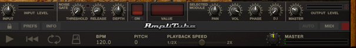
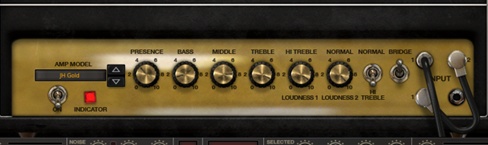
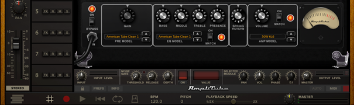

## **Signal level**

The signal coming from the instrument passes through multiple stages where its level can and should be controlled to prevent unwanted signal clipping, distortion and noise.

AmpliTube 4

 

Amplifier panels in Amp A and B sections usually have at least one volume regulation, sometimes more

 

 

 

